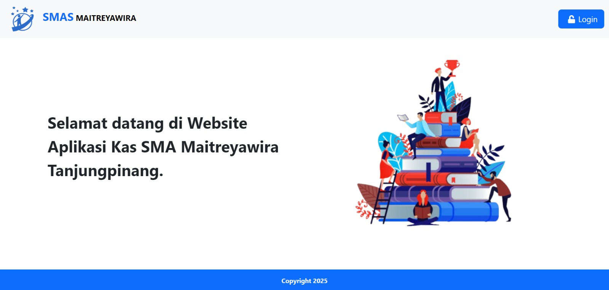
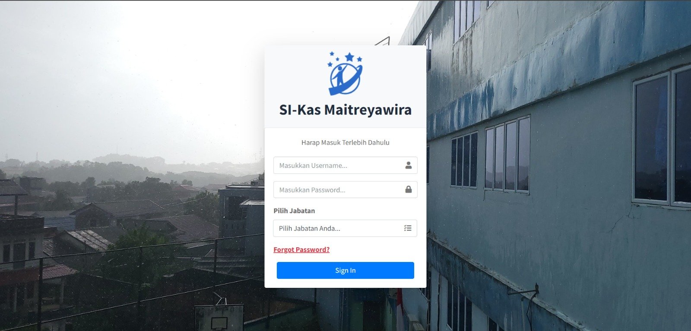
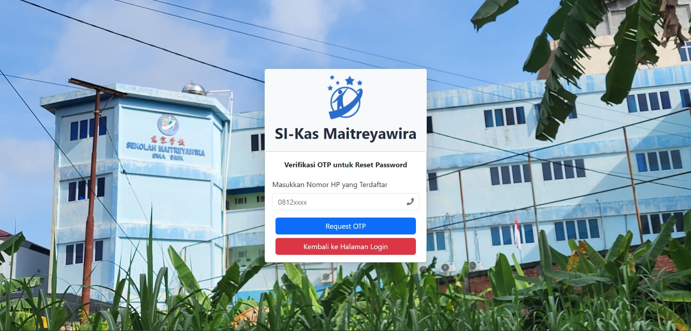
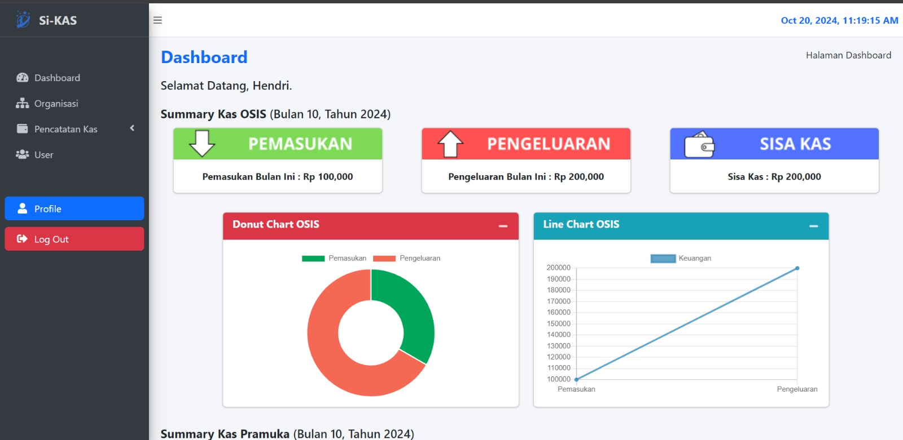
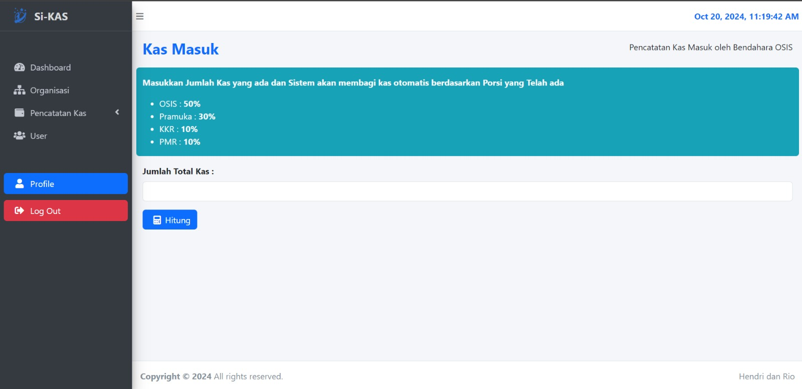
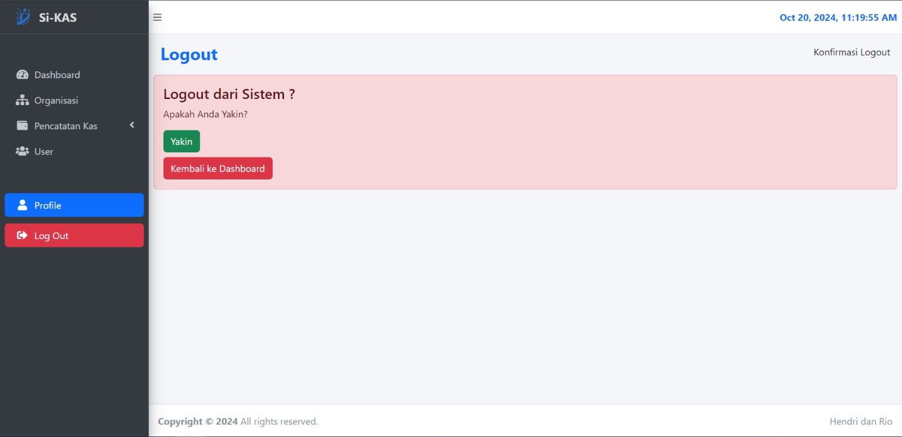

# Aplikasi Kas Organisasi berbasis Web - SMA Maitreyawira

Project ini dibuat untuk Sekolah SMAS Maitreyawira Tanjungpinang
Project ini dibuat menggunakan _PHP v8.1.10_ dan _Composer v2.8.1_

## Team Developer

- [@Cytus2nd](https://www.github.com/cytus2nd)
- [@CytusTheBeginner](https://www.github.com/cytusthebeginner)
- [@RioMelows](https://www.github.com/RioMelows)

## Screenshots Aplikasi













## Instalasi dan Menjalankan Project pada Localhost

UNTUK PENGGUNA APLIKASI LARAGON

- Download aplikasi laragon pada *https://laragon.org/download/*
- Download atau Clone project ini kedalam _/laragon/www/_
- Jalankan aplikasi Laragon pada _/laragon/laragon.exe_
- Start Web Server dan MySQL pada aplikasi Laragon
- Jalankan Chrome lalu masuk ke url _localhost/phpmyadmin_
- Import Database dari _laragon/www/KP-Si-KAS/database/_
- Masuk ke url _localhost/KP-Si-Kas_

UNTUK PENGGUNA APLIKASI XAMPP

- Download aplikasi XAMPP
- Download atau Clone project ini kedalam _/xampp/htdocs/_
- Jalankan aplikasi XAMPP
- Start Web Server Apache dan MySQL pada aplikasi XAMPP
- Jalankan Chrome lalu masuk ke url _localhost/phpmyadmin_
- Import Database dari _xampp/htdocs/KP-Si-KAS/database/_
- Masuk ke url _localhost/KP-Si-Kas_

Project ini memerlukan Composer yang dapat di install di *https://getcomposer.org/download/*

Project ini menggunakan FPDF

```bash
  $ composer require setasign/fpdf:^1.8
```
